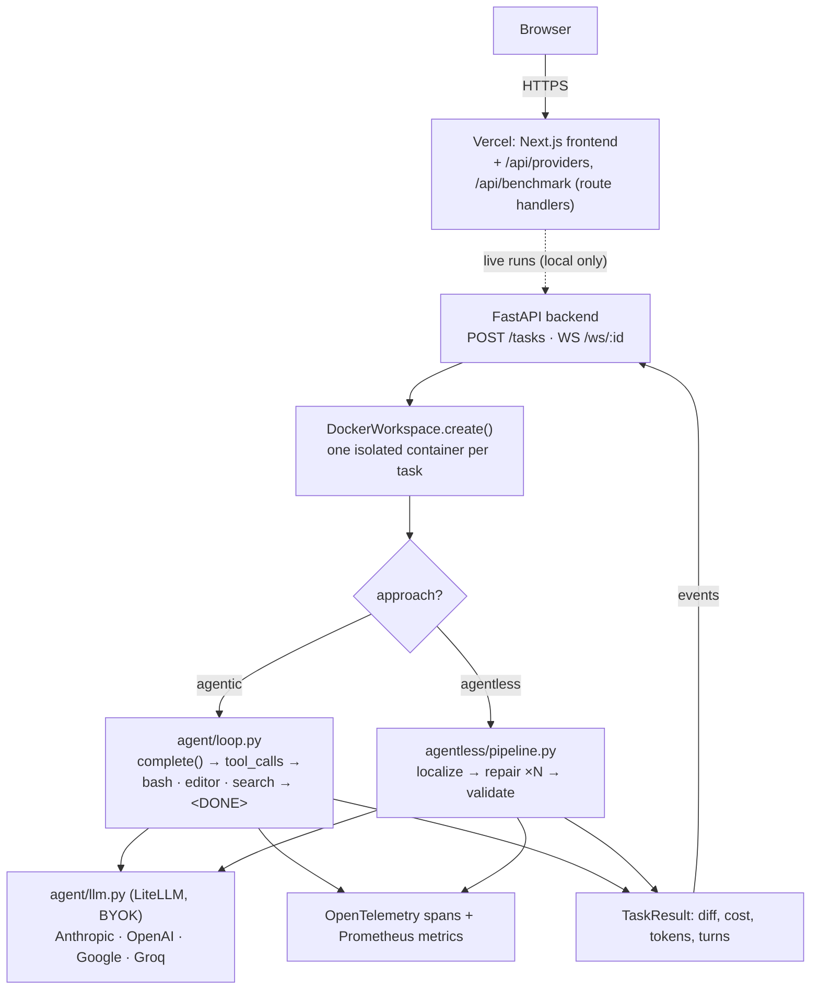

# Autonomous SWE Agent

Resolves real GitHub issues two ways — an **agentic tool-use loop** vs. a **3-phase
agentless pipeline** — on the same benchmark, with full cost/token/turn accounting.

[](https://github.com/shiva-shivanibokka/Autonomous-SWE-Agent/actions/workflows/ci.yml)


[](https://autonomous-swe-agent.vercel.app)

## Recruiter TL;DR
- **What it is:** an autonomous software-engineering agent that takes a GitHub issue,
  produces a code patch inside an isolated Docker sandbox, and verifies it against the
  repo's test suite — implemented two ways (a tool-driven agent and a tool-free
  localize→repair→validate pipeline) so they can be compared on the same 300 issues.
- **Hardest parts solved:** a provider-agnostic **BYOK** LLM layer (Anthropic / OpenAI /
  Google / Groq via one interface, no server key), an **Agent-Computer Interface** tuned
  to prevent common model mistakes, a context-window budget manager, per-task Docker
  isolation, and end-to-end observability (OpenTelemetry + Prometheus).
- **Status (be exact):** fully built, unit-tested, and **deployed** (frontend live on
  Vercel); **not yet run end-to-end** — no real agent run or benchmark has been executed,
  so there are no measured results yet. See **Project Status** below.

---

## ⚠️ Project Status — read this first

This is an **intended / demonstrated** project, not a system with measured results.

| ✅ Done & verifiable | ⏳ Not done / not verified |
|---|---|
| Both architectures fully implemented | **No real agent run has executed** end-to-end |
| BYOK multi-provider client (4 providers) | **No benchmark run** — the results table is empty by design |
| Docker-per-task sandbox (network-isolated) | Hosted demo **replays a scripted sample** trace, not a live run |
| ACI tools + hybrid BM25/embedding search | Sandbox command **timeout isn't enforced** (known latent bug) |
| Context-budget compression | No integration tests for the sandbox / agentless pipeline |
| OTel tracing + Prometheus metrics | In-harness grading is a heuristic proxy, not the official grader |
| FastAPI + WebSocket streaming API | Live runs work **locally only** (need Docker) |
| Frontend live on Vercel; CI green; unit tests pass | — |

Any resolve-rate/cost figures you see referenced (e.g. Anthropic's ~49%, Agentless' ~32%)
are the **source papers'**, not this system's. This repo provides the *implementation and
the harness to reproduce such a comparison* — running it (Docker + a paid key + compute)
is the remaining step, tracked in [`TODO.md`](TODO.md).

---

## Overview

Given a GitHub issue, the agent must produce a patch that makes the previously-failing
tests pass **without** breaking the passing ones (the official SWE-bench criteria). The
project's actual thesis is **comparison and legibility**: run two very different
architectures on identical inputs and make every internal — cost, tokens, turns, tool
calls, traces — completely visible.

- **Agentic** — one model drives a free-form loop with three tools (bash, a file editor,
  hybrid code search) until it declares done. Mirrors Anthropic's published SWE-bench setup.
- **Agentless** — a deterministic pipeline: localize the fault → sample N candidate
  patches → run tests and keep the best. Mirrors the UIUC *Agentless* paper. No tool use.

**Why build it rather than use an existing agent?** The value is re-implementing the
Agent-Computer Interface and the agentless pipeline from raw SDK calls, with full
instrumentation — the things an interviewer actually probes. A black-box framework would
hide exactly what this project exists to demonstrate.

Grounded in: [Anthropic's SWE-bench work](https://www.anthropic.com/engineering/swe-bench-sonnet),
[Agentless (Xia et al., 2024)](https://arxiv.org/abs/2407.01489),
[SWE-agent (Princeton, 2024)](https://arxiv.org/abs/2405.15793).

## Features

- **Two swappable architectures** behind a shared sandbox + LLM client.
- **Bring-your-own-key, multi-provider** (Anthropic / OpenAI / Google / Groq) via one
  LiteLLM-based `complete()` call — keys are per-request, never stored or logged.
- **Per-task Docker isolation** — fresh container per issue, non-root, resource-capped,
  `network_mode=none`, host FS never mounted (files moved via tar archive).
- **Engineered ACI tools** — `bash`, `str_replace_editor` (unique-match enforced), and a
  BM25 + sentence-embedding hybrid `search_codebase`.
- **Context-window budget manager** — compresses old turns near the limit, respecting
  OpenAI/Groq tool-message ordering rules.
- **Streaming** — a FastAPI backend streams agent events over WebSocket as they happen.
- **Observability** — OpenTelemetry spans (→ Jaeger) and Prometheus counters/gauges/
  histograms for resolve rate, cost, tokens, and latency.
- **Live frontend** — a Next.js "telemetry console" on Vercel that hosts its own read-only
  API routes (no separate backend host required).

## Architecture



**Why this shape.** The **sandbox is the trust boundary** — the model issues arbitrary
shell commands against arbitrary third-party code, so all execution is confined to a
throwaway, network-less container (and one-per-task guarantees no state bleed across
benchmark issues). The **LLM client is the provider seam** — one normalized `complete()`
contract means the same loop runs on four providers with the user's own key. The
**agentic and agentless paths share only the sandbox and the client**, so the two
experiments stay cleanly separable. The **hosted API is folded into the Vercel app**
because the live site only needs two read-only endpoints — no second host to run or pay
for.

## Tech Stack

| Layer | Choice | Why |
|---|---|---|
| LLM access | **LiteLLM** | One OpenAI-shaped interface (incl. tool calling + cost) across 4 providers — avoids four fragile SDK adapters. |
| Backend | **FastAPI + Uvicorn** | Async/ASGI with first-class WebSockets for streaming agent events; Pydantic validation. |
| Sandbox | **Docker SDK** | OS-level isolation (namespaces/cgroups) for untrusted code; one container per task. |
| Search | **rank-bm25 + sentence-transformers (MiniLM) + NumPy** | Lexical + semantic retrieval fused; BM25-only fallback if transformers absent. |
| Tokens | **tiktoken** | Fast token estimate to trigger context compression. |
| Observability | **OpenTelemetry + Prometheus** | Traces answer "what did this run do"; metrics answer "resolve rate / cost / latency." |
| Eval | **swebench** | Canonical 300-issue dataset + FAIL/PASS-to-PASS grading criteria. |
| Frontend | **Next.js (App Router) on Vercel** | RSC + route handlers let one app host the read-only API for free. |
| Robustness | **tenacity** | Exponential-backoff retry on flaky GitHub API calls. |

## Skills Demonstrated

- **LLM application development / agentic systems** — tool-calling loop, ACI design,
  agentless localize→repair→validate pipeline.
- **Containerization & Docker** — per-task isolation, resource limits, tar-based file I/O.
- **System design & architecture** — documented tradeoffs (isolation vs. speed, BYOK vs.
  server key, folded vs. separate backend).
- **Asynchronous / concurrent systems** — thread pool for blocking Docker/LLM work bridged
  to an async WebSocket via `run_coroutine_threadsafe`.
- **Observability & monitoring** — OpenTelemetry tracing + Prometheus metrics + health check.
- **RESTful + WebSocket API design** — FastAPI endpoints with Pydantic validation and live streaming.
- **CI/CD** — GitHub Actions (lint, unit tests, docker build, smoke-eval gate).
- **Cloud deployment (Vercel)** — git-connected auto-deploy; app-hosted API routes.
- **Application security** — BYOK secrets model (no stored server key), scoped CORS, `wss://`.
- **Automated testing** — unit tests for the provider layer, agent-loop control flow (mocked
  model), tools, and context manager.

## Getting Started

**Prerequisites:** Python 3.11+, Docker (for live runs / eval), and an API key for at
least one provider (only needed for real runs — the frontend and unit tests need neither).

```bash
git clone https://github.com/shiva-shivanibokka/Autonomous-SWE-Agent
cd Autonomous-SWE-Agent
pip install -e ".[dev]"
cp .env.example .env
# BYOK: set the provider key(s) you'll use for local eval runs —
# ANTHROPIC_API_KEY / OPENAI_API_KEY / GEMINI_API_KEY / GROQ_API_KEY.
# No key is stored server-side; keys are used per request.
```

Build the sandbox image (needed for any real agent run or eval):

```bash
docker build -f sandbox/Dockerfile.sandbox -t swe-agent-sandbox:latest sandbox/
```

Run the local stack (API + Jaeger + Prometheus, live runs enabled):

```bash
docker-compose up
# API:        http://localhost:8000
# Jaeger UI:  http://localhost:16686
# Prometheus: http://localhost:9091
```

Run the frontend locally (optional; it's also live on Vercel):

```bash
cd frontend && npm install && npm run dev   # http://localhost:3000
# Point it at the local API for live runs:
#   NEXT_PUBLIC_API_BASE=http://localhost:8000
```

## Usage

**Run the agent on one issue (BYOK).** `run_agent` is a generator: it yields `AgentEvent`s
and returns a `TaskResult` via `StopIteration.value`.

```python
from dotenv import load_dotenv; load_dotenv()
from agent.llm import LLMConfig
from agent.loop import run_agent
from sandbox.docker_workspace import DockerWorkspace

llm = LLMConfig(provider="anthropic", model="claude-sonnet-5", api_key="sk-ant-...")

with DockerWorkspace.create(
    repo_url="https://github.com/psf/requests.git",
    commit_sha="<base_commit_sha>",
) as ws:
    gen = run_agent(ws, issue_text="Title: ...\n\n<issue body>", llm)
    try:
        while True:
            event = next(gen)          # thought | tool_call | tool_result | cost_update | done
            print(event.type, event.data)
    except StopIteration as done:
        result = done.value            # TaskResult
        print("resolved(heuristic):", result.resolved, "cost $:", round(result.cost_usd, 4))
```

**Run the benchmark harness** (bring your own key; nothing has been run yet):

```bash
# Quick comparison on 10 instances (~$5–10 on a frontier model)
python -m eval.run_eval --compare --limit 10 --provider anthropic

# Full SWE-bench-lite (300 instances)
python -m eval.run_eval --compare

# One approach, a different provider
python -m eval.run_eval --approach agent --limit 50 --provider openai --model gpt-5.6-terra
python -m eval.run_eval --approach agentless --limit 50 --provider groq
```

Providers/models live in `agent/providers.py`.

## Benchmark Results

**No benchmark has been run yet — this table is intentionally empty.** No numbers are
fabricated. Running `eval.run_eval --compare` populates it; paste the two summary objects
into `frontend/data/benchmark.json` and the live site fills in automatically.

| Metric | Agentic | Agentless |
|---|---|---|
| % Resolved | — | — |
| Resolved / Total | — / 300 | — / 300 |
| Avg Cost / Issue | — | — |
| Avg Turns | — | — (3 phases) |
| Model | BYOK (any provider) | BYOK (any provider) |

## Project Structure

```
Autonomous-SWE-Agent/
├── agent/
│   ├── loop.py            # Agentic loop (raw LLM calls via llm.py; the model drives)
│   ├── llm.py             # Provider-agnostic BYOK client (LiteLLM)
│   ├── providers.py       # Provider + model registry (single source of truth)
│   ├── prompts.py         # System prompt + ACI workflow
│   ├── context.py         # Context-window budget manager / compression
│   └── tools/             # bash · str_replace_editor · search_codebase
├── agentless/             # localize → repair(×N) → validate → pipeline
├── sandbox/               # docker_workspace.py + Dockerfile.sandbox (isolated per task)
├── eval/                  # harness.py + run_eval.py (SWE-bench-lite runner, BYOK CLI)
├── github_integration/    # issue_fetcher.py + pr_creator.py
├── observability/         # tracing.py (OTel) + metrics.py (Prometheus)
├── api/                   # main.py (FastAPI + WS) + schemas.py (Pydantic)
├── frontend/              # Next.js app on Vercel (+ /api route handlers)
├── tests/                 # Unit tests (mocked — no Docker/LLM/network)
├── Dockerfile.serve       # Light serving image (no PyTorch) for optional API hosting
└── docker-compose.yml     # Local full stack: API + Jaeger + Prometheus
```

## Testing

Unit tests are fully mocked (no Docker, no LLM, no network) and run in CI:

```bash
pytest tests/            # provider registry, agent-loop flow, tools, context manager
ruff check . --select E,F,I,UP --ignore E501
```

**Coverage is honest and partial:** the provider layer, the agent loop's control flow
(with a mocked model), the tools, and the context manager are covered. There are **no
integration tests** for the Docker sandbox or the agentless pipeline (Docker- and
cost-gated), and **no end-to-end test** of a real agent run — closing that gap is the
top roadmap item.

## Deployment

| Piece | Where | How |
|---|---|---|
| **Frontend + hosted API** (`frontend/`) | **Vercel** (live) | Git-connected, root dir `frontend`. Read-only `/api/providers` + `/api/benchmark` are Next.js route handlers in the same app — no separate backend host. |
| **Full backend** (live runs, eval, tracing) | **Local** | `docker-compose up` (`ENABLE_LIVE_RUNS=true`); point the frontend at it via `NEXT_PUBLIC_API_BASE`. |
| **Full backend, hosted** (optional) | Any container host | `Dockerfile.serve` (light, no PyTorch) deploys the Python API anywhere that takes a Dockerfile. |

Live agent runs need a Docker sandbox, so the **hosted site is replay-only by design**;
live runs happen locally.

## Roadmap / Known Limitations

Tracked in [`TODO.md`](TODO.md). Highlights:

- **Run it for real** — a single end-to-end run (even one issue on a cheap model) to turn
  "should work" into "works," then a full `--compare` benchmark to fill the results table.
- **Record a real demo trace** to replace the bundled scripted sample in the console.
- **Enforce sandbox command timeouts** (currently a latent bug — not enforced, and the
  timeout branch references a non-existent attribute).
- Add a hard per-task cost ceiling; persist runs (Redis) for multi-worker scaling.
- Integration tests for the sandbox + agentless pipeline; wire the official SWE-bench grader.

## License

[MIT](LICENSE) © 2026 Shivani Bokka

## References

- [SWE-bench (Princeton, 2024)](https://arxiv.org/abs/2310.06770)
- [SWE-agent: Agent-Computer Interfaces (Princeton, 2024)](https://arxiv.org/abs/2405.15793)
- [Agentless (UIUC, 2024)](https://arxiv.org/abs/2407.01489)
- [Anthropic: Raising the bar on SWE-bench Verified](https://www.anthropic.com/engineering/swe-bench-sonnet)
