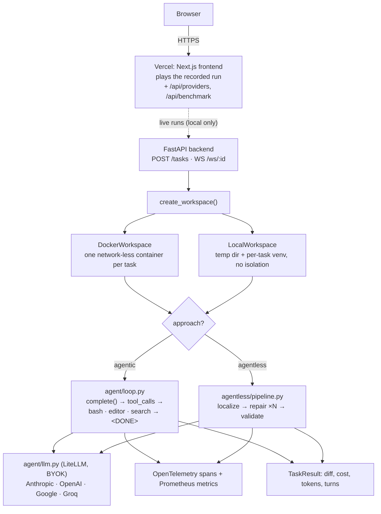

# Autonomous SWE Agent

Takes a GitHub issue, writes a patch inside an isolated workspace, and runs the
repository's own tests against it — built two ways, an **agentic tool-use loop**
and a **tool-free agentless pipeline**, so the same task can be run through both
and compared with every token, turn and dollar accounted for.

[](https://github.com/shiva-shivanibokka/Autonomous-SWE-Agent/actions/workflows/ci.yml)


**[View the recorded run →](https://autonomous-swe-agent.vercel.app)**

> ### This is a replay, not a live service
>
> The page above plays back **one real agent run**, captured with
> `python -m eval.record_run` and committed to this repository. Every line of it
> is measured: the model's own reasoning, the tool calls it chose, the token
> counts and dollar cost the provider billed, the patch it produced, and the
> result of running the benchmark's own tests against that patch afterwards.
> Only the pacing is synthetic: the gaps where the model was thinking are
> clamped, so a 30-second run replays in about 21.
>
> **There is no hosted backend.** A run needs several minutes, a checkout of a
> third-party repository, and a shell to execute code that nobody has vetted.
> No free tier offers that, and putting a "Run" button on a public page that
> executes arbitrary repositories with someone else's key would be a bad idea
> even if one did. So the honest options were a dead button or a real recording,
> and this is the recording.
>
> **You can run it live in two commands** — see
> [Run it yourself](#run-it-yourself). No Docker required.

---

## What the recorded run shows

One SWE-bench-lite instance, run for real and graded against its own tests.

| | |
|---|---|
| Task | [`pallets__flask-4992`](https://github.com/pallets/flask) — *"Add a file mode parameter to `flask.Config.from_file()`"* |
| Model | `anthropic/claude-sonnet-5` (BYOK) |
| Result | **Resolved** — 1 FAIL_TO_PASS + 18 PASS_TO_PASS, `pytest` exit 0 |
| Cost | **$0.1115** |
| Turns | 8 |
| Tokens | 48,228 |
| Wall clock | 30s |
| Patch | 43 lines, one file |

What makes this instance a fair test: the issue *proposes* `mode="b"`, but the API
Flask actually shipped — and therefore the API the graded test calls — is
`text=False`. An agent that implements what the issue asks for fails. This one
read the surrounding code, chose `text: bool = True`, updated the docstring
example from `toml` to `tomllib`, added the `versionchanged` note, then ran the
suite, used `git stash` to confirm the remaining failures were pre-existing, and
stopped. That is the whole run, and it is what the page replays.

## What it does

Given a GitHub issue, produce a patch that makes the previously-failing tests
pass without breaking the passing ones — the official SWE-bench criterion. Two
implementations share a workspace and an LLM client and nothing else:

- **Agentic** — one model drives a free-form loop with three tools (bash, a file
  editor, hybrid code search) until it declares itself done. Mirrors Anthropic's
  published SWE-bench setup.
- **Agentless** — a deterministic pipeline: localize the fault → sample N
  candidate patches → run tests and keep the best. No tool use at all. Mirrors
  the UIUC *Agentless* paper.

The point is the comparison and the legibility. Two very different architectures,
identical inputs, and every internal — cost, tokens, turns, tool calls, traces —
visible rather than hidden behind a framework.

Grounded in: [Anthropic's SWE-bench work](https://www.anthropic.com/engineering/swe-bench-sonnet),
[Agentless (Xia et al., 2024)](https://arxiv.org/abs/2407.01489),
[SWE-agent (Princeton, 2024)](https://arxiv.org/abs/2405.15793).

## Status — what is and is not measured

| Verified | Not done |
|---|---|
| Both architectures implemented and runnable | **No full 300-instance benchmark has been run** — the results table is empty on purpose |
| One real agent run recorded, **graded as resolved**, and published | The agentless arm has not been recorded end to end |
| Runs end to end on a real SWE-bench-lite instance | In-harness grading is a capped proxy, not the official grader |
| Two workspace backends: Docker sandbox, and local (no Docker) | No integration tests for the Docker backend (Docker-gated) |
| BYOK across four providers through one client | |
| Hard timeouts, per-task isolation, secret scanning on recordings | |
| 85 unit tests, ruff clean, CI green | |

Any resolve-rate figures you see referenced elsewhere (Anthropic's ~49%, Agentless'
~32%) belong to **those papers**, not to this system. Nothing here is extrapolated
from them.

## Run it yourself

Two paths. Pick based on whether you have Docker.

### Without Docker — the fast path

The agent runs against a checkout in a temp directory on your machine.

```bash
git clone https://github.com/shiva-shivanibokka/Autonomous-SWE-Agent
cd Autonomous-SWE-Agent
pip install -e ".[dev]"
cp .env.example .env        # add one provider key: ANTHROPIC_API_KEY, OPENAI_API_KEY, …
```

```bash
python -m eval.record_run \
  --instance pallets__flask-4992 --backend local \
  --setup 'python -m pip install -q -r requirements/tests.txt && python -m pip install -q "pytest>=7.4,<8" "werkzeug<2.3"' \
  --pytest-args '-W ignore::DeprecationWarning'
```

That clones the repository at the exact commit the issue was filed against,
gives it its own virtualenv, hands the issue to the agent, and grades the
resulting patch against the instance's own FAIL_TO_PASS and PASS_TO_PASS tests.
The recording lands in `frontend/public/demo/run.json`, which the frontend picks
up automatically.

> ⚠️ **The local backend is not a sandbox.** The model's shell commands run as
> you, on your machine, with your network and your filesystem. There is a
> refusal list for the obviously catastrophic commands and a hard timeout on
> every command, but that narrows the blast radius rather than removing it.
> Point it at repositories you already trust; use Docker for anything else.

### With Docker — the isolated path

One throwaway container per task, `network_mode=none`, non-root, memory- and
CPU-capped, host filesystem never mounted. This is the right backend for a
benchmark over 300 arbitrary repositories.

```bash
docker build -f sandbox/Dockerfile.sandbox -t swe-agent-sandbox:latest sandbox/
export WORKSPACE_BACKEND=docker          # the default
python -m eval.record_run --instance pallets__flask-4992
```

Or bring up the whole local stack — API, Jaeger, Prometheus:

```bash
docker-compose up
# API        http://localhost:8000
# Jaeger UI  http://localhost:16686
# Prometheus http://localhost:9091
```

### Run the benchmark

```bash
pip install -e ".[eval]"                                   # SWE-bench dataset
python -m eval.run_eval --compare --limit 10               # 20 runs; the one measured run cost $0.11
python -m eval.run_eval --approach agent --limit 50 --provider openai
```

Results write to `eval/results/`. Paste the two summary objects into
`frontend/data/benchmark.json` and the site's benchmark table fills itself in.

### Run the frontend

```bash
cd frontend && npm install && npm run dev      # http://localhost:3000
# For live runs against a local backend:
#   NEXT_PUBLIC_API_BASE=http://localhost:8000
```

## Architecture


```mermaid
flowchart TD
    B["Browser"] -->|HTTPS| V["Vercel: Next.js frontend<br/>plays the recorded run<br/>+ /api/providers, /api/benchmark"]
    V -.->|"live runs (local only)"| API["FastAPI backend<br/>POST /tasks · WS /ws/:id"]
    API --> WS["create_workspace()"]
    WS --> D["DockerWorkspace<br/>one network-less container per task"]
    WS --> L["LocalWorkspace<br/>temp dir + per-task venv, no isolation"]
    D --> AG{"approach?"}
    L --> AG
    AG -->|agentic| LOOP["agent/loop.py<br/>complete() → tool_calls →<br/>bash · editor · search → &lt;DONE&gt;"]
    AG -->|agentless| P["agentless/pipeline.py<br/>localize → repair ×N → validate"]
    LOOP --> LLM["agent/llm.py (LiteLLM, BYOK)<br/>Anthropic · OpenAI · Google · Groq"]
    P --> LLM
    LOOP --> OBS["OpenTelemetry spans + Prometheus metrics"]
    P --> OBS
    LOOP --> R["TaskResult: diff, cost, tokens, turns"]
    P --> R
```

**Why this shape.** The **workspace is the trust boundary** — the model issues
arbitrary shell commands against arbitrary third-party code, so execution is
confined and one-per-task guarantees no state bleed between benchmark instances.
Making it an interface rather than a class is what lets the project run on a
machine with no Docker: same loop, same tools, different backend, and the model
cannot tell which one it has. The **LLM client is the provider seam** — one
normalized `complete()` contract means the same loop runs on four providers with
the caller's own key. The **agentic and agentless paths share only those two
things**, so the two experiments stay cleanly separable.

## Tech Stack

| Layer | Choice | Why |
|---|---|---|
| LLM access | **LiteLLM** | One OpenAI-shaped interface (tool calling + cost) across four providers — avoids four fragile SDK adapters. |
| Backend | **FastAPI + Uvicorn** | Async ASGI with first-class WebSockets for streaming agent events; Pydantic validation. |
| Sandbox | **Docker SDK** | OS-level isolation for untrusted code; one container per task. |
| Fallback backend | **subprocess + venv** | Same contract, no daemon — the project stays runnable without Docker. |
| Search | **rank-bm25 + NumPy** (+ optional MiniLM) | Lexical retrieval always; semantic half is an extra, since it costs ~2.5 GB of PyTorch. |
| Tokens | **tiktoken** | Fast estimate to trigger context compression before the window runs out. |
| Observability | **OpenTelemetry + Prometheus** | Traces answer "what did this run do"; metrics answer "resolve rate / cost / latency". |
| Eval | **SWE-bench-lite** | 300 real issues with FAIL_TO_PASS / PASS_TO_PASS grading. Loaded over HTTP so the heavy package is optional. |
| Frontend | **Next.js (App Router) on Vercel** | Static page plus two read-only route handlers — no second host to run or pay for. |

## What running it found

The unit suite was green before any of this and caught none of it. Every one of
these only appears when the thing actually executes:

| Bug | Why it mattered |
|---|---|
| Repo streamed into the container as **root**, agent ran as `sweagent` | Every edit failed and `git diff` returned empty — every task would have scored zero, looking like model failure |
| `SANDBOX_CMD_TIMEOUT` was **accepted and ignored** | One hanging test suite hangs the entire run, forever |
| The timeout branch read `workspace._timeout_seconds`, which never existed | The moment a timeout did fire, `AttributeError` instead of a message to the model |
| `subprocess` timeout killed only the shell, not its children | A 3-second deadline took 30 seconds to return |
| Pytest summary parsed `"2 failed, 5 passed"` as **5 passed, 0 failed** | The agentless validator crowned patches that broke the tests |
| Agentless asked for a whole rewritten file inside a JSON string | Any file over the token cap truncated → unparseable → candidate silently dropped |
| Eval never applied the instance's `test_patch` | The graded tests did not exist in the checkout; both approaches would have reported 0% |
| Agentless validated candidates against the **graded** tests | Marking its own homework |
| Search index cached per task, built with the first call's `file_pattern` | Later searches silently answered from the wrong corpus |
| Agent loop caught only `LLMError` | Any tool or sandbox failure escaped the generator, discarding the diff, cost and event log |
| Undo buffer keyed by path alone | Concurrent eval workers restored each other's files |
| `git diff HEAD` omitted untracked files | A patch that adds a new module read as "changed nothing" |
| Shallow clone + checkout of a years-old commit | Most SWE-bench instances could not be checked out at all |

The frontend had its own version of the same problem: the console shipped a
hand-written `SAMPLE_RUN` with invented reasoning, invented token counts and an
invented `4 passed in 3.21s`, streaming into the UI looking exactly like a real
run. It is now a real run or nothing — `frontend/scripts/validate-run.mjs` fails
the build if the recording is missing, malformed, or contains anything
key-shaped.

## Benchmark Results

**No full benchmark run exists yet, and this table is empty rather than
estimated.** Running `eval.run_eval --compare` fills it.

| Metric | Agentic | Agentless |
|---|---|---|
| % Resolved | — | — |
| Resolved / Total | — / 300 | — / 300 |
| Avg cost / issue | — | — |
| Avg turns | — | — (3 phases) |

## Project Structure

```
Autonomous-SWE-Agent/
├── agent/
│   ├── loop.py            # Agentic loop — the model drives, tools dispatch
│   ├── llm.py             # Provider-agnostic BYOK client (LiteLLM)
│   ├── providers.py       # Provider + model registry (single source of truth)
│   ├── prompts.py         # System prompt + ACI workflow
│   ├── context.py         # Context-window budget manager / compression
│   └── tools/             # bash · str_replace_editor · search_codebase
├── agentless/             # localize → repair(×N) → validate → pipeline
├── sandbox/
│   ├── workspace.py       # The contract both backends implement
│   ├── docker_workspace.py# Container per task, network-less, non-root
│   └── local_workspace.py # Temp dir + per-task venv, no isolation
├── eval/
│   ├── harness.py         # SWE-bench-lite loader, grading, aggregation
│   ├── run_eval.py        # Benchmark CLI
│   └── record_run.py      # Records the run the frontend replays
├── github_integration/    # issue_fetcher.py + pr_creator.py
├── observability/         # tracing.py (OTel) + metrics.py (Prometheus)
├── api/                   # main.py (FastAPI + WS) + schemas.py (Pydantic)
├── frontend/              # Next.js app on Vercel (+ /api route handlers)
└── tests/                 # 85 unit tests — mocked, no Docker/LLM/network
```

## Testing

```bash
pytest tests/          # 85 tests, fully mocked
ruff check .           # uses the rule set in pyproject.toml
```

Coverage is partial and stated as such: the provider layer, the agent loop's
control flow (mocked model), the three tools, the context manager, the local
backend's path translation, and a regression test for each bug listed above.
There are **no integration tests** for the Docker backend, and no end-to-end
test of a real agent run — that is what `eval.record_run` is for, and it costs
money to run.

## Known limitations

- **Grading is a proxy.** `eval/harness.py` applies the instance's test patch and
  runs the FAIL_TO_PASS / PASS_TO_PASS ids it names, capped at 20 tests. The
  official SWE-bench grader re-runs the full sets inside their own per-instance
  images. Numbers from this harness are indicative.
- **Environment pinning is manual.** SWE-bench instances are years old and often
  need dependency pins a modern interpreter would not choose. `--setup` takes
  that command and records it with the run; there is no per-instance environment
  database.
- **The agentless arm is unrecorded.** It runs, and its parts are tested, but no
  captured end-to-end run of it is published yet.
- **Single worker.** The API's task store is in-process. Scaling out needs Redis
  before raising the worker count.

## License

[MIT](LICENSE) © 2026 Shivani Bokka

## References

- [SWE-bench (Princeton, 2024)](https://arxiv.org/abs/2310.06770)
- [SWE-agent: Agent-Computer Interfaces (Princeton, 2024)](https://arxiv.org/abs/2405.15793)
- [Agentless (UIUC, 2024)](https://arxiv.org/abs/2407.01489)
- [Anthropic: Raising the bar on SWE-bench Verified](https://www.anthropic.com/engineering/swe-bench-sonnet)

---

Built by **Shivani Bokka**
